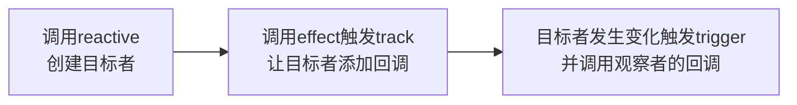
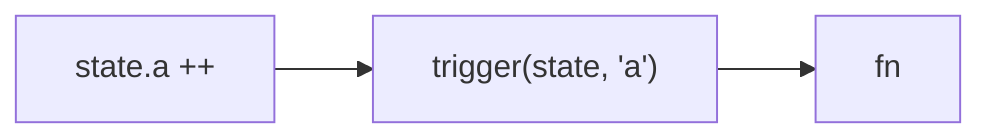

<div flex>
<div flex-1 h-540px overflow-scroll>

```js
function reactive(target) {
  return new Proxy(target, {
    get(obj, key) {
      const res = obj[key]
      track(obj, key)
      return res
    },
    set(obj, key, value) {
      obj[key] = value
      trigger(obj, key)
      return true
    },
  })
}

let activeEffect = null

function effect(fn) {
  activeEffect = fn
  fn()
  activeEffect = null
}

const targetMap = new WeakMap()

function track(target, key) {
  if (!activeEffect) return
  let depsMap = targetMap.get(target)
  if (!depsMap) {
    targetMap.set(target, (depsMap = new Map()))
  }
  let deps = depsMap.get(key)
  if (!deps) {
    depsMap.set(key, (deps = new Set()))
  }
  deps.add(activeEffect)
}

function trigger(target, key) {
  const depsMap = targetMap.get(target)
  if (!depsMap) {
    return
  }
  const deps = depsMap.get(key)
  if (deps) {
    deps.forEach(fn => fn())
  }
}
```
</div>

<div v-click>


```js
const state = reactive({ a: 1 })

effect(() => {
  console.log(state.a)
})

state.a ++
```

<div mt-4 mb-2>执行过程</div>



<div text-xs mt-2>第一次执行完effect后targetMap状态</div>

```js
TargetMap<{
  state: {
    a: [fn]
  }
}>
```

<div text-xs mt-4 mb-3>赋值触发set中的trigger,然后去targetMap中找副作用函数并执行</div>


</div>
</div>

<codicon-debug-start
  v-click
  class="text-xs c-black absolute left-2 top-10"
  @click="$slidev.nav.openInEditor('./examples/1-reactive/demo.js')"
/>

<style>
  .slidev-layout {
    padding-top: 0px;
    padding-bottom: 0px;
    padding-left: 20px;
    padding-right: 20px;
  }
</style>