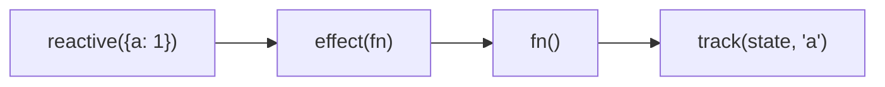
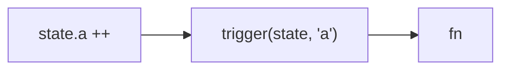

<div flex>
<div flex-1 h-540px overflow-scroll>

```js
export function isObject(target) {
  return typeof target === 'object' && target !== null
}

// 判断是否是响应式对象
export function isReactive(target) {
  return target && target.__v_isReactive
}

// 创建响应式对象
// 通过 Proxy 代理对象，拦截对象的读取和设置操作，并通过 track 和 trigger 函数收集和触发依赖
export function reactive(target) {
  // 如果 target 不是对象，直接返回
  if (!isObject(target)) {
    return target
  }

  // 如果 target 已经是响应式对象，直接返回, 避免重复代理
  if (isReactive(target)) {
    return target
  }

  return new Proxy(target, {
    get(obj, key) {
      // 提供给 isReactive 方法使用
      if (key === '__v_isReactive') {
        return true
      }
      const res = obj[key]
      // 当effect中运行函数触发响应式对象读取时，就会触发依赖收集，并按照effect进行分组
      track(obj, key)

      // 递归处理嵌套对象, 这也是vue2 和 vue3 响应式主要区别之一，只有当读取到对象的键值时，
      // 才会将对象类型的值转换为响应式对象
      // 这样也解决了 vue2 需要 $set 才能动态给对象添加响应式属性的问题
      return isObject(res) ? reactive(res) : res
    },
    set(obj, key, value) {
      obj[key] = value
      trigger(obj, key) // 触发依赖
      return true
    },
  })
}

// 当前激活的 effect
let activeEffect = null

// 副作用函数
export function effect(fn) {
  activeEffect = fn
  fn()
  activeEffect = null
}

/**
 * vue响应源和副作用函数关联存储结构图
 *
 * 响应式对象桶
 *
 * WeakMap<
 *  ReactiveObject, // 响应式对象是key
 *  Map<            // 值是Map类型
 *    key,          // 响应式对象的键是key
 *    Set<effect>   // 存储所有依赖于当前key 的 effect
 *  >
 * >
 */
const targetMap = new WeakMap()

/**
 * 收集响应式依赖，将当前激活的 effect 函数收集到依赖中
 * 这个方法通常是在 reactive 函数中的 Proxy 的 get 拦截器中自动触发的
 */
export function track(target, key) {
  if (!activeEffect) {
    return
  }
  let depsMap = targetMap.get(target)
  if (!depsMap) {
    targetMap.set(target, (depsMap = new Map()))
  }
  let deps = depsMap.get(key)
  if (!deps) {
    depsMap.set(key, (deps = new Set()))
  }
  deps.add(activeEffect)
}

/**
 * 触发依赖，当响应式对象的值发生变化时，触发依赖
 * 这个方法通常是在 reactive 函数中的 Proxy 的 set 拦截器中自动触发的
 */
export function trigger(target, key) {
  const depsMap = targetMap.get(target)
  if (!depsMap) {
    return
  }
  const deps = depsMap.get(key)
  if (deps) {
    deps.forEach(fn => fn())
  }
}
```
</div>

<div v-click>


```js
const state = reactive({ a: 1 })

effect(() => {
  console.log(state.a)
})

state.a ++
```

<div mt-4 mb-2>调用过程</div>



<div text-xs mt-2>第一次执行完effect后targetMap状态</div>

```js
TargetMap<{
  state: {
    a: [fn]
  }
}>
```

<div text-xs mt-4 mb-3>赋值触发set中的trigger,然后去targetMap中找副作用函数并执行</div>


</div>
</div>

<codicon-debug-start
  v-click
  class="text-xs c-black absolute left-2 top-10"
  @click="$slidev.nav.openInEditor('./examples/1-reactive/demo.js')"
/>

<style>
  .slidev-layout {
    padding-top: 0px;
    padding-bottom: 0px;
    padding-left: 20px;
    padding-right: 20px;
  }
</style>