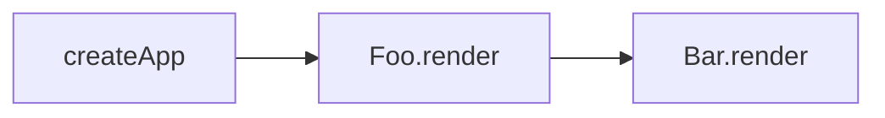

<div flex>

<div flex-1>
<h1>逻辑分支管理</h1>

<v-click>

```js
const state = reactive({ a: 10, flag: false })

effect(() => {
  console.log(state.flag ? state.a : null)
})

state.flag = true
state.a = 20
state.a = 30

```
</v-click>


<codicon-debug-start
  v-click
  class="text-xs c-black absolute left-2 bottom-70 z-1"
  @click="$slidev.nav.openInEditor('./examples/1-reactive/issues.js')"
/>

<div text-xs>
  <div v-click mt-4>1. 初始化响应式数据源时分支未激活，导致部分依赖错过收集期</div>
  <div v-click mt-2>2. 当一个分支暂时失焦时，没有清理该分支内数据源</div>
</div>

</div>
</div>

---
layout: section
---

<div flex>

<div flex-1>
<h2 v-click>this指向问题</h2>

<div v-after>

```js
const target = {
  foo: 1,
  get value() {
    return this.foo
  },
}
const state = reactive(target)

effect(() => {
  console.log(state.value)
})

state.foo++ // 期待打印 2，实际打印1，说明this指向了原对象
```
</div>

</div>

<div flex-1 relative z1 ml-8>
<h2 v-click>实际相当于</h2>
<v-click>

```js
// 因为修改的是原对象，
// 实际上述代码执行结果和此处相同
const obj = { a: 1 }
const state = reactive(obj)

effect(() => {
  console.log(state.a)
})

obj.a = 30

```
</v-click>

</div>

</div>

<style>
  .slidev-layout {
    padding-top: 0px;
    padding-bottom: 0px;
  }
  .slidev-layout h3 {
    font-weight: 400;
    color: rgba(0, 0, 0, 0.75);
  }
</style>

---

# Reflect & Proxy
<div v-click>
在一些静态类型语言里面，Reflect（反射）是用来在运行时读取对象，并且能修改或读取对象的一种机制。
```java
Class clz = Class.forName("com.chenshuyi.reflect.Apple"); // java
Method method = clz.getMethod("setPrice", int.class);
Constructor constructor = clz.getConstructor();
Object object = constructor.newInstance();
method.invoke(object, 4);
```
</div>

<div v-click>
js是弱类型脚本语言, 不需要这种机制，只要对象有属性，属性是个方法。在es11的可选链语法下，能更安全且方便的来操作运行时的对象。
```js
window.sayHello?.() // javascript
```
</div>

<div v-click>
众所周知，Object 几乎没有几个方法, Reflect是Object对象方法的补充，能直接操作Object,
并且它的方法基本和Proxy能拦截的方法基本一致，所以也是和Proxy配套出现的Api。
```js
Reflect.get      Proxy({ get: () => {} })
Reflect.set      Proxy({ set: () => {} })
Reflect.deleteProperty   Proxy({ deleteProperty: () => {} })
Reflect.defineProperty Proxy({ defineProperty: () => {} })
...
```
</div>


<style>
  .slidev-layout {
    padding-top: 40px;
    padding-bottom: 0px;
  }
</style>


---
src: /points/branch&reflect.md
---

---
layout: two-cols
---

响应性代码
```js
const state = reactive({ foo: 1, bar: 2 })

effect(function fnA() {
  console.log(state.foo)
})

effect(function fnB() {
  console.log(state.foo + state.bar)
})
```

原来的单向关联数据结构
```ts
TargetMap<{
  state: {
    foo: [fnA, fnB],
    bar: [fnB]
  }
}>
```

::right::
双向关联的数据结构
```ts
TargetMap<{
  state: {
    foo: [
      Effect<fnB, TargetMap[state][foo]>,
      Effect<fnA, TargetMap[state][foo]>
    ],
    bar: [
      Effect<fnB, TargetMap[state][bar]>
    ]
  }
}>

interface Effect<Fn, Deps> {
  effectFn: Fn
  deps: Deps
}

```
---
layout: two-cols
---
<div mr-6>

<h1>嵌套Effect</h1>

组件树是如何渲染的？
```jsx
const Foo = {
  render() {
    return <Bar/>
  }
}

const Bar = {
  render() {
    return <div>hello</div>
  }
}
createApp(Foo).mount('#app')
```

</div>

::right::
<div v-click>
渲染顺序

</div>
<div v-click text-xs bg-gray-100 p-2 mb-4>
vue render方法产生了一份VDOM，而VDOM是响应式主要依赖，为了能让VDOM有响应性。实际上每个render
都会在effect中执行
</div>

<v-click>

```js
effect(() => {
  Foo.render()
  effect(() => {
    Bar.render()
  })
})
```

</v-click>

<div v-click mt-4>
为啥是嵌套effect而不是扁平effect？
</div>

<ul text-xs>
  <li v-click>1. 存在props的情况下，子effect是依赖于父级effect的</li>
  <li v-click>2. vue render过程是同步的</li>
</ul>

<codicon-debug-start 
  v-click
  class="text-xs c-black absolute left-2 bottom-6 z-1"
  @click="$slidev.nav.openInEditor('./examples/2-reactive/issues.js')"
/>

---
src: /points/effect-stack.md
---

---
layout: outro
---

# 可调度性


vue中同步执行的代码只会触发一次页面更新？

nextTick为什么总能准确的在下次页面更新后执行？

computed为什么只有当依赖变化后才会触发重新计算？

---
src: /points/scheduler.md
---

---
layout: section
---
# computed

computed 和 effect 共同点
* 能响应响应式数据源变化

不同点
* computed 不会立即执行一次
* computed 有缓存，当值没有发生变化不会重新计算

```js
const state = reactive({ a: 1 })

const double = computed(() => state.a * 2)

effect(() => {
  console.log(double.value)
})

state.a ++
```


---
src: /points/computed.md
---

---
layout: section
---
# watch

watch 和 effect实际上也非常相似，区别是watch能控制是否进

行初始执行，能观测到上一次值、和控制响应时机
```js
const state = reactive({ a: 1 })

watch(() => state.a, (newVal, oldVal) => {
  console.log(newVal, oldVal)
}, {
  immediate: true
})

state.a ++
```

---
src: /points/watch.md
---


---
layout: two-cols
---
# 竞态问题

<div text-xs>
  在多线程编程语言中，竞态是一个经常被提及的问题，比如线程之间同时写入数据库，并且也有一些配套的解决方案。
</div>
<div text-xs mt-4>
  前端只有单线程，所以竞态问题常常被忽略。那么前端是不是不存在竞态问题呢？
</div>

<v-click>

```js
const state = reactive({ id: 1 })
const data = ref()

watch(state, async (newVal) => {
  const res = await fetch('/user/' + newVal.id)
  data.value = res.data
})

state.id = 2
state.id = 3
```
</v-click>

<div v-click text-xs mt-4>
如上代码所示，我们无法确定 data.value 具体会是哪一次网络请求的执行结果。vue对于watch api
的清理过期副作用给出了一个解决方案
</div>

::right::
<div v-click ml-8>

```js

const state = reactive({ id: 1 })
const data = ref()

watch(state, async (newVal, _, onCleanup) => {
  let isClear = false

  // 每当一个新的 state.id 修改触发watch，如果上一个副作用函数还没有执行完，将触发回调，修改
  // 上一个副作用函数的 isClear
  onCleanup(() => {
    isClear = true
  })

  const result = await fetch('/user/' + newVal.id)

  // 如果当前副作用没有被清理
  if (!isClear) {
    data.value = res.data
  }
})

state.id = 2
state.id = 3
```
</div>

<codicon-debug-start 
  v-click
  class="text-xs c-black absolute left-2 bottom-70 z-1"
  @click="$slidev.nav.openInEditor('./examples/6-watch/demo2.js')"
/>


---
layout: section
---

<div flex>

  <div flex-1 mr-8>
  <h2>过滤同步值</h2>

  ```js
  const state = reactive({ a: 1 })

  effect(() => {
    // 这里会打印四次，但是vue在同步代码中，对数据进
    // 行多次赋值，只会取最后更新的一次来对页面进行渲染
    // 以节省性能开销
    console.log(state.a) 
  })

  state.a ++
  state.a ++
  state.a ++
  ```
  </div>

  <div flex-1 v-click relative z1>
  
  ```js {monaco}
  const jobQueue = new Set()
  const p = Promise.resolve()

  let isFlushing = false

  function flushJob() {
    if (isFlushing) {
      return
    }
    // 标记正在清空任务队列，防止多次清空队列
    // 微任务会在同步任务之后执行，所以之后同步执行的代码触发了调度器
    // 也只会将当前effect推入任务队列，并且调用flushJob也会被这里阻挡
    isFlushing = true
    p.then(() => {
      jobQueue.forEach(job => job())
      isFlushing = false
      jobQueue.clear()
    })
  }

  const state = reactive({ a: 1 })

  effect(() => {
    console.log(state.a)
  }, {
    scheduler(fn) {
      jobQueue.add(fn)
      flushJob()
    }
  })

  state.a ++
  state.a ++
  ```
  </div>
</div>

<style>
  .slidev-code {
    zoom: .85;
  }
</style>


---
# ref实现

---

<h1 text-center mt-47>谢谢观看</h1>
