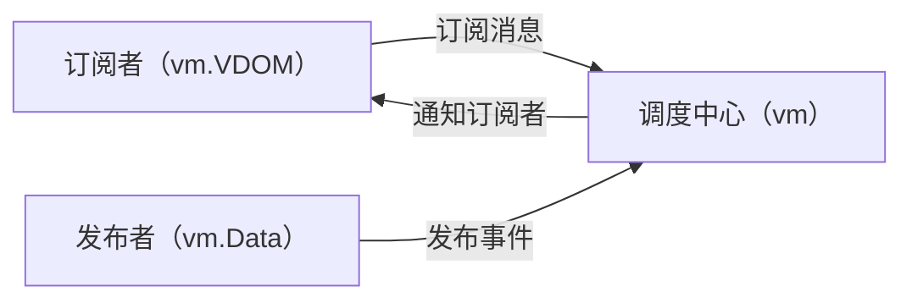
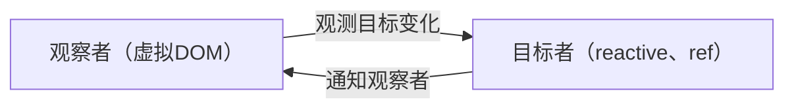

# VUE响应式原理及实现


<!-- 
#### 学了响应式原理有什么用？
- 面试需要
- 写出性能更好的代码

#### 只学会vue的响应式原理没毛用

把学习vue响应式原理当成一个切入点，横向切入其他框架、库的设计思想。集百家所长，融会贯通。


#### 分享目的

帮助每一个人完全了解 vue 响应式系统是怎么实现的，和实现过程中会有什么问题，及一些扩展知识。

 -->
---
layout: two-cols
---
<div mr8>

# 什么是响应式编程？

<SpreadSheet />

</div>

::right::

<v-clicks>

# VUE响应性原理是什么？

<div mt8>

- 基于发布订阅模式实现的 vue2

</div>

<div mt8>

- 基于观察者模式实现的 vue3

</div>

</v-clicks>

<style>
  .slidev-vclick-target {
    transition: all 500ms ease;
  }

  .slidev-vclick-hidden {
    transform: scale(0);
    transition-origin: left center;
  }

  ul {
    margin-top: 20px;
  }
</style>

<!--

#### 发布订阅模式的缺点：

- 响应式和运行时高度耦合，代码之间关联紧密，不利于框架层面维护
- 不利于 tree-shaking

 -->

---
layout: two-cols-footer
transition: slide-up
level: 2
---
::left::

# VUE最小响应式单元

```ts {monaco-run}{autorun:false}
import { reactive, effect } from 'vue'

const state = reactive({ count: 1 })
effect(() => {
  console.log('Run effect: ' + state.count)
})

state.count++
```


::right::
<v-click>

# SOLID-JS最小响应单元

```tsx
import { createSignal } from 'solid-js'

const Counter = () => {
  const [count, setCount] = createSignal(1)
  const increment = () => setCount(prev => prev + 1)

  return (
    <button type="button" onClick={increment}>
      {count()}
    </button>
  )
}
```

</v-click>

::footer::
<v-clicks>

# Signal (信号)
**在访问时跟踪依赖，在依赖变更时能在特定容器里触发副作用**

[深入了解响应式系统](https://cn.vuejs.org/guide/extras/reactivity-in-depth#connection-to-signals)

</v-clicks>

<!--

#### effect
vue 实际上会把 effect 封装到组件树渲染过程中，所以可能较少接触到。

effect 直接翻译过来叫 `副作用`， 但其实在vue 响应式系统中，翻译成 ``响应域`` 更合适

响应式对象，只有在 effect 中才能拥有响应性


-->

---
layout: three-cols-header
transition: fade-out
---

# 实现一个简易响应式系统

::main::

```ts {monaco-run} {autorun:false}
import { effect, reactive } from './reactivity'

const state = reactive({ count: 1 })

effect(() => {
  console.log('Run effect: ' + state.count)
})

state.count++
```

::left::
<div v-click="1">
<<< @/snippets/reactivity.ts#effect ts {all|all|4-6|all}{lines:true}
</div>

::center::

<div v-click="3">
<<< @/snippets/reactivity.ts#reactive ts {all|3-7|8-11|all}{lines:true}
</div>


::right::
<div v-click="6">
<<< @/snippets/reactivity.ts#track ts {all|5-8|9-12|13|3-14|17-24|22-24|all}{lines:true}
</div>

<style scoped>
  .slidev-code {
    font-size: 10px !important;
    line-height: 13px !important;
  }
</style>

<!-- 
先阐述响应式内部原理，effect 和  reactive 的关联，并引导出关联的 track 和 trigger 

通过动画流程来演示效果
 -->


---
layout: two-cols-footer
transition: slide-up
---

# WeakMap 和 Map 区别


```ts
// 响应式数据存储结构
type TargetMap<T extends Reactive> = WeakMap<
  Reactive,
  Map<keyof T, Set<() => void>>
>
```

::left::

<div mr8 v-click>

## Map
```js {monaco-run}{autorun: false}
const map = new Map()

let obj = {}
map.set(obj, 'map')

console.log("回收前Map键数: " + map.size)

obj = null

console.log("回收后Map键数: " + map.size)
```
</div>

::right::
<div v-click>

## WeakMap
```js
const map = new WeakMap()

let obj = {}
map.set(obj, 'weakmap')

console.log(map)

obj = null

setTimeout(() => {
  console.log(map)
}, 6500)
```
</div>


<style scoped>
  .col-header {
    height: 100px !important;
  }
</style>


<!--
开发者不应该只注重实现，还需要站在更高的角度来考虑到`内存`、`性能`、`体验`等问题

发散：`代码体积`、`图片体积`
-->

---
layout: two-cols-footer
transition: fade-in
---

# 分支切换问题

::left::
<div v-if=" $clicks === 0">
<<< @/snippets/branch.ts ts {monaco-run}{autorun:false}
</div>

<div v-else>
<<< @/snippets/branch.ts ts {all|3,6,9}
</div>

::right::
<v-clicks>

1. 初始化响应式数据源时分支未激活，导致部分依赖错过收集期
2. 当一个分支暂时失焦时，没有清理该分支内数据源 

</v-clicks>

<style scoped>
  .slidev-code {
    padding: 13px 18px !important;
    font-size: 11.5px !important;
  }
</style>

---
transition: slide-up
layout: two-cols-footer
level: 2
---
# this指向问题

::right::

```ts {monaco-run}{autorun:false}
import { effect, reactive } from './reactivity'

const target = {
  foo: 1,
  get value() {
    return this.foo
  },
}
const state = reactive(target)

effect(() => {
  console.log(state.value)
})

state.foo++ // 期待打印 2
```
---
layout: two-cols-footer
---
# 嵌套Effect 问题

::left::

组件树是如何渲染的？
```jsx
const Foo = {
  render() {
    return <Bar/>
  }
}

const Bar = {
  render() {
    return <div>hello</div>
  }
}
createApp(Foo).mount('#app')
```

```ts
effect(() => {
  Foo.render()
  effect(() => {
    Bar.render()
  })
})
```
---
layout: two-cols-footer
---
# 重复依赖死循环问题

::left::
```ts {monaco-run}{autorun:false}
import { effect, reactive } from './reactivity'

const state = reactive({ count: 1 })

effect(() => {
  console.log(state.count)
  state.count ++
})

state.count ++
```
---
layout: two-cols-footer
---

# 可调度性

::left::
<v-clicks>

1. 为什么同步执行过程只会触发一次页面更新？
</v-clicks>

::right::
<SfcPlayer v-if="$clicks === 1">

```html
<template>
  <div>{{ console.log(state.count) }}</div>
  <div @click="calc">计算</div>
</template>

<script setup>
  import { reactive } from 'vue'
  const state = reactive({ count: 1 })

  const calc = () => {
    state.count = 10
    state.count = 20
  }
</script>
```
</SfcPlayer>