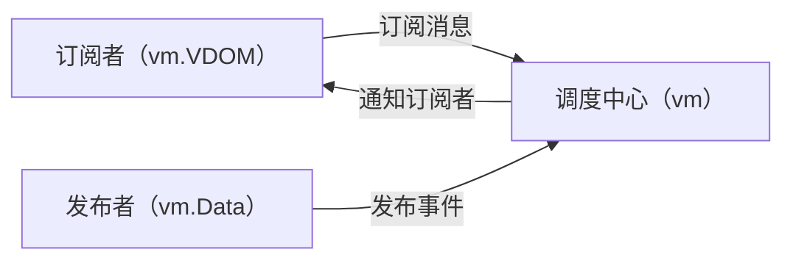
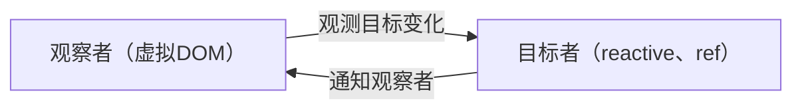
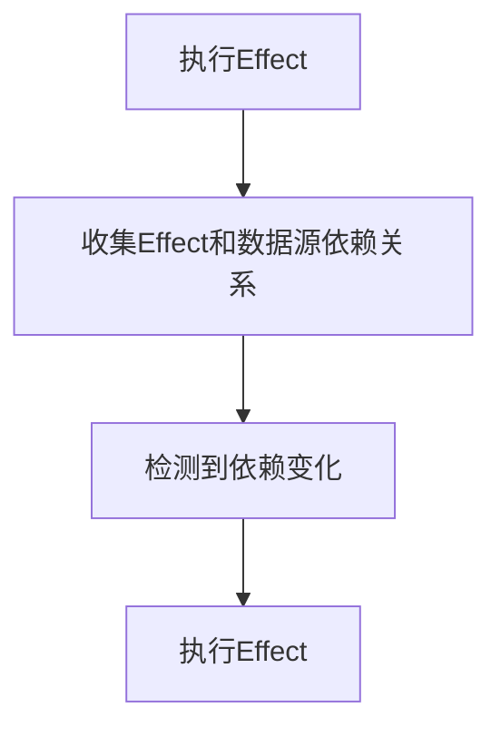
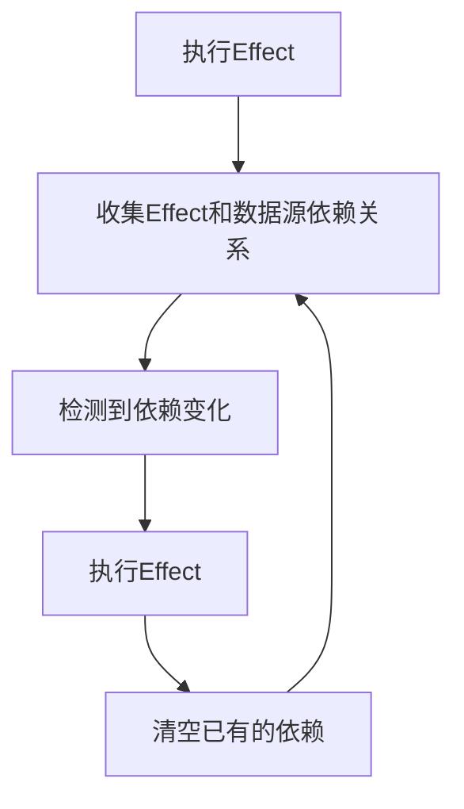

# VUE响应式原理及实现


<!-- 
#### 学了响应式原理有什么用？
- 面试造车，虽然我们的工作是开车，但开车总不是一帆风顺的，遇到故障，不会造车，怎么能相信你有修好车的能力呢？
- 写出性能更好、更优秀的代码

#### 只学会vue的响应式原理没毛用

把学习vue响应式原理当成一个切入点，横向切入其他框架、库的源码设计思想。集百家所长，融会贯通。


#### 分享目的

帮助每一个人完全了解一个响应式系统是怎么实现的，和实现过程中会有什么问题，及一些相关的扩展知识。

 -->
---
layout: two-cols-footer
---

::left::
<div mr8>

# 什么是响应式编程？

<SpreadSheet />

</div>

::right::

<v-clicks>

# VUE响应性原理是什么？

<div mt8>

- 基于发布订阅模式实现的 vue2

</div>

<div mt8>

- 基于观察者模式实现的 vue3

</div>

</v-clicks>

<!-- TODO 移动到最后面 -->
::footer::
<v-clicks>

- [slidev：面向开发人员的幻灯片](https://sli.dev)
- [penjj/talks：本次演示幻灯片源码地址](https://github.com/penjj/talks)

</v-clicks>

<style>
  .slidev-vclick-target {
    transition: all 500ms ease;
  }

  .slidev-vclick-hidden {
    transform: scale(0);
    transition-origin: left center;
  }

  ul {
    margin-top: 20px;
  }
</style>

<!--

发布者和订阅者之间是解耦的，完全没有任何关联。但解耦的同时，也带来了一些问题：
- 逻辑重心需要放到调度中心（event-center）上，event-center 和响应式系统高度耦合。框架的代码不好维护
- 不利于 tree-shaking

 -->

---
layout: two-cols-footer
transition: slide-up
level: 2
---
::left::

# VUE最小响应式单元

```ts {monaco-run}{autorun:false}
import { reactive, effect } from 'vue'

const state = reactive({ count: 1 })
effect(() => {
  console.log('Run effect: ' + state.count)
})

state.count++
```


::right::
<v-click>

# SOLID-JS最小响应单元

```tsx
import { createSignal } from 'solid-js'

const Counter = () => {
  const [count, setCount] = createSignal(1)
  const increment = () => setCount(prev => prev + 1)

  return (
    <button type="button" onClick={increment}>
      {count()}
    </button>
  )
}
```

</v-click>

::footer::
<v-clicks>

# Signal (信号)
**在访问时跟踪依赖，在依赖变更时能在特定容器里触发副作用**

[深入了解响应式系统](https://cn.vuejs.org/guide/extras/reactivity-in-depth#connection-to-signals)

</v-clicks>

<!--

#### effect
vue 实际上会把 effect 封装到组件树渲染过程中，所以可能较少接触到。

effect 直接翻译过来叫 `副作用`， 但其实在vue 响应式系统中，翻译成 ``响应域`` 更合适

响应式对象，只有在 effect 中才能拥有响应性


-->

---
layout: three-cols-header
transition: fade-out
---

# 实现一个简易响应式系统

::main::

```ts {monaco-run} {autorun:false}
import { effect, reactive } from './reactivity'

const state = reactive({ count: 1 })

effect(() => {
  console.log('Run effect: ' + state.count)
})

state.count++
```

::left::
<div v-click="1">
<<< @/snippets/reactivity.ts#effect ts {all|all|4-6|all}{lines:true}
</div>

::center::

<div v-click="3">
<<< @/snippets/reactivity.ts#reactive ts {all|3-7|8-11|all}{lines:true}
</div>


::right::
<div v-click="6">
<<< @/snippets/reactivity.ts#track ts {all|5-8|9-12|13|3-14|17-24|22-24|all}{lines:true}
</div>

<style scoped>
  .slidev-code {
    font-size: 10px !important;
    line-height: 13px !important;
  }
</style>

<!-- 
先阐述响应式内部原理，effect 和  reactive 的关联，并引导出关联的 track 和 trigger 

通过动画流程来演示效果
 -->


---
layout: two-cols-footer
transition: slide-up
---

# WeakMap 和 Map 区别


```ts
// 响应式数据存储结构
type TargetMap<T extends Reactive> = WeakMap<
  Reactive,
  Map<keyof T, Set<() => void>>
>
```

::left::

<div mr8 v-click>

## Map
```js {monaco-run}{autorun: false}
const map = new Map()

let obj = {}
map.set(obj, 'map')

console.log("回收前Map键数: " + map.size)

obj = null

console.log("回收后Map键数: " + map.size)
```
</div>

::right::
<div v-click>

## WeakMap
```js
const map = new WeakMap()

let obj = {}
map.set(obj, 'weakmap')

console.log(map)

obj = null

setTimeout(() => {
  console.log(map)
}, 6500)
```
</div>


<style scoped>
  .col-header {
    height: 100px !important;
  }
</style>


<!--
开发者不应该只注重实现，还需要站在更高的角度来思考问题

比如，我们项目里面岌岌可危的几个方向 `代码体积`、`内存占用`、`加载速度`、`类型安全`等等，总之还是
需要不断打磨自己的作品。

《黑客与画家》作者是一个程序员也是一个画家，他认为程序员和画家是相同的，他们都是艺术家。
艺术家会选择不断打磨自己的作品来达到完美的状态。比如达芬奇的画作，在现代X光检测下，能发现会有多个不
同的修改版本，直到最终达到相对比较理想的状态。

TODO：放到后面
为什么拒绝学习呢？vue3刚开源的时候，issues 里面很多国内开发者提出的issue, 标题基本上都是学不动
了。
其实我觉得这种行为挺反智的，一方面向全世界展示了国内的开发者个人素养，另一方面也对外展示国内的大环境，
《人类简史》里面说到，采集时代的智人，每天只需要工作两三小时用来采集水果就能满足生活所需。进入农耕
社会，智人每天需要工作8小时以上，才能满足生活所需，即使这样，可能还会有人饿死。但这样的环境下也没有
人能脱离整个农耕社会社会回到采集时代，整个人类社会都在推动着你前进，你只能选择接受。
-->

---
layout: two-cols-footer
transition: slide-up
---

# 分支切换问题

::left::

<<< @/snippets/branch.ts ts {monaco-run}{autorun:false}

::right::

<<< @/snippets/branch-inactive.ts ts {monaco-run}{autorun:false}

::footer::
<v-clicks>

1. 初始化响应式数据源时分支未激活，导致部分依赖错过收集期
2. 当一个分支暂时失焦时，没有清理该分支内数据源 

</v-clicks>

<style scoped>
  .slidev-code {
    padding: 13px 18px !important;
    font-size: 11.5px !important;
  }
</style>

<!-- 
我们想要左右代码如何运行
 -->

---
transition: slide-up
layout: two-cols-footer
---

::left::
# 单次收集依赖



::right::
# 多次收集依赖


---
transition: slide-up
layout: two-cols-footer
---

# cleanup 分支依赖清理

::left::

```js
export function effect(fn) {
  const effectFn = () => {
    try {
      const { deps } = effectFn
      deps.forEach(dep => dep.delete(effectFn))
      deps.length = 0
      activeEffect = effectFn
      fn()
    } finally {
      activeEffect = null
    }
  }
  effectFn.deps = []
  effectFn()
}
```

::right::

```js {15,16}{lines: true}
export function track(target, key) {
  if (!activeEffect) {
    return
  }
  let depsMap = targetMap.get(target)
  if (!depsMap) {
    targetMap.set(target, (depsMap = new Map()))
  }
  let deps = depsMap.get(key)
  if (!deps) {
    depsMap.set(key, (deps = new Set()))
  }

  deps.add(activeEffect)
  // 建立effect 和 deps 间的双端关联关系
  activeEffect.deps.push(deps)
}
```

---
transition: slide-left
layout: two-cols-footer
---

# cleanup 后再次执行

::left::
```ts {monaco-run}{autorun:false}
import { effect, reactive } from './reactivity-fix'

const state = reactive({ a: 10, flag: false })

effect(() => {
  console.log(state.flag ? state.a : null)
})

state.flag = true
state.a = 20
state.a = 30

```

::right::

```ts {monaco-run}{autorun:false} 
import { effect, reactive } from './reactivity-fix'

const state = reactive({ a: 10, flag: true })

effect(() => {
  console.log(state.flag ? state.a : null)
})

state.flag = false
state.a = 20
state.a = 30
```


---
transition: slide-up
level: 2
layout: two-cols-footer
clicks: 4
---
::left::
# this指向问题
<div v-if="$clicks === 0">

```ts {monaco-run}
import { effect, reactive } from './reactivity'

const target = {
  foo: 1,
  get value() {
    return this.foo
  },
}
const state = reactive(target)

effect(() => {
  console.log(state.value)
})

state.foo++
```

</div>

<div v-if="$clicks === 1">

```ts {monaco-run}
import { effect, reactive, targetMap } from './reactivity'

const target = {
  foo: 1,
  get value() {
    return this.foo
  },
}
const state = reactive(target)

effect(() => {
  console.log(state.value)
})
console.log(targetMap.get(target))
state.foo++
```

</div>


<div v-if="$clicks === 2">
 
```js {monaco-run}
const target = { 
  count: 1, 
  get value() { 
    return this.count
  } 
}

const res = new Proxy(target, {
  get(obj, key) {
    console.log(key)
    return obj[key]
  }
})

console.log(res.value)
```
</div>


<div v-if="$clicks >= 3">
 
```js {monaco-run}{autorun: false}
const target = { 
  count: 1, 
  get value() { 
    return this.count
  } 
}

const res = new Proxy(target, {
  get(obj, key) {
    console.log(key)
    return Reflect.get(obj, key, res)
  }
})

console.log(res.value)
```
</div>

::right::
<div v-click="[4]">

# Reflect（反射）
> Reflect 是一个内置的对象，它提供拦截 JavaScript 操作的方法。这些方法与 proxy handler 的方法相同。Reflect 不是一个函数对象，因此它是不可构造的。
```js {monaco-run}{autorun: false}
const targetA = {
  get value() {
    return this.count
  }
}

const targetB = {
  count: 10
}

console.log(
  Reflect.get(targetA, 'value', targetB)
)

```

</div>
<!-- 
期待打印2，但实际打印的1

只用通过Proxy返回的对象存取值，才能触发 get、set 拦截器，而这里的this 实际指向了target对象

那能通过从 返回对象取 属性来触发get吗？不行，因为会循环触发get

众所周知，js 能通过 bind/apply/call 改变函数里的this指向，但是大家听说过有办法能改变setter/getter的this指向吗？

好巧不巧，还真有
 -->

---
layout: two-cols-footer
---
# 嵌套Effect 问题

::left::

组件树是如何渲染的？
```jsx
const Foo = {
  render() {
    return <Bar/>
  }
}

const Bar = {
  render() {
    return <div>hello</div>
  }
}
createApp(Foo).mount('#app')
```

```ts
effect(() => {
  Foo.render()
  effect(() => {
    Bar.render()
  })
})
```
